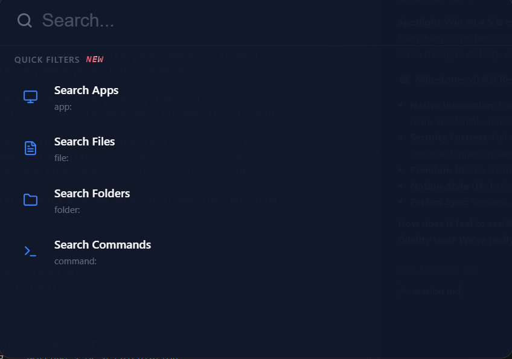

# Spotlight-Win

A streamlined search bar and application launcher for Windows designed for speed and local-first privacy.

## What It Does

Spotlight-Win provides a centralized interface to interact with your computer. It replaces the traditional start menu search with a faster, more predictable experience.

- **Find and Launch**: Instantly locate applications, files, and system tools.
- **Web Shortcuts**: Create custom aliases (e.g., `yt`) to open specific websites in your default browser.
- **Smart Calculations**: Perform math directly in the search bar (e.g., `12 * 5.5`).
- **System Controls**: Quick access to power actions like `Shutdown`, `Restart`, or `Lock`.
- **Advanced Filtering**: Use context-aware tags like `app:`, `file:`, `folder:`, or `command:` to narrow your search.
- **Privacy Focused**: All indexing and history data stay on your local machine. No cloud tracking.

## Screenshots

<p align="center">
  
</p>

## Quick Start

1. **Open**: Press `Ctrl + Space` to summon the search bar.
2. **Type**: Enter the name of an app (e.g., "Notepad") or a calculation.
3. **Execute**: Press `Enter` to open the top result or use `Arrow Keys` to navigate.
4. **Close**: Press `Escape` or click away to hide the launcher.

## Features

- **Adaptive Ranking**: Prioritizes results based on your usage frequency and time-of-day habits.
- **Fuzzy Matching**: Finds what you're looking for even if you make a typo.
- **Low Resource Usage**: Built with Rust to ensure it doesn't slow down your background system processes.
- **Persistent History**: Remembers your most recent launches for one-click access.
- **Contextual Tags**: Visual filters transform into beautiful tags, keeping your search bar clean and professional.

## Installation

### Prerequisites

- [Rust](https://www.rust-lang.org/tools/install) (stable)
- [Node.js](https://nodejs.org/) (LTS)
- [WebView2 Runtime](https://developer.microsoft.com/en-us/microsoft-edge/webview2/) (Included in modern Windows 10/11)

### Setup

1. Clone the repository:

   ```bash
   git clone https://github.com/Snaehath/Win-Spotlight.git
   cd Win-Spotlight
   ```

2. Install dependencies:

   ```bash
   npm install
   ```

3. Run in development mode:

   ```bash
   npm run tauri dev
   ```

## Usage

| Action                  | Shortcut                  |
| :---------------------- | :------------------------ |
| **Toggle Launcher**     | `Ctrl + Space`            |
| **Navigate Results**    | `Arrow Up` / `Arrow Down` |
| **Launch / Action**     | `Enter`                   |
| **Reveal in Folder**    | `Shift + Enter`           |
| **Remove from History** | `Alt + Delete`            |
| **Hide Launcher**       | `Escape`                  |

### Advanced Search Filters

Type a filter prefix followed by a colon to enter specialized search modes. The prefix will transform into a visual tag automatically.

- `app:` Search only for installed applications.
- `file:` Search only for documents and files.
- `folder:` Search only for directories.
- `command:` Access system actions (Shutdown, Lock, Math, etc.).

### Special Commands

- `> clear shortcuts`: Wipes all saved web aliases.
- `CREATE_SHORTCUT:[URL]`: Triggers the UI to save a new web shortcut.

## Architecture Overview

Spotlight-Win is split into two main layers:

1. **The Core (Rust)**: Handles heavy lifting like file system indexing, full-text search (via Tantivy), and system-level commands.
2. **The Interface (Tauri/JS)**: A lightweight frontend that handles user input and visual rendering.

The system uses an asynchronous watcher to keep the file index in sync with your disk changes without blocking the UI.

## Tech Stack

- **Language**: Rust (Backend), JavaScript (Frontend)
- **Framework**: [Tauri v2](https://v2.tauri.app/)
- **Search Engine**: [Tantivy](https://github.com/quickwit-oss/tantivy) (Full-text search library)
- **Icons**: [Lucide](https://lucide.dev/)

## Performance

- **Search Latency**: Generally under 1ms for local queries.
- **Memory Usage**: Typically stays between 40MB - 70MB while active in the background.
